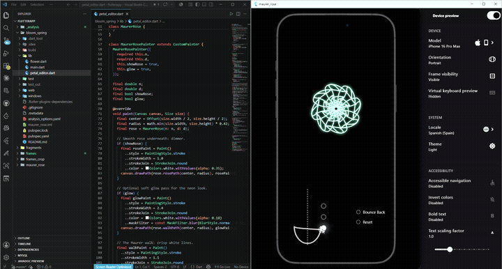

# Bloom Spring

A parametric flower animation built in Flutter with spring-physics bounce-back interaction.



## What it does

An interactive flower drawn with `CustomPainter` that reacts to a draggable petal editor:

- **Drag** the control handle → the petal tips wind inward into a spiral while the body stays anchored.
- **Bounce Back** → the flower snaps back with an elastic spring overshoot (underdamped physics).
- **Reset** → smooth return to the resting state.

## How it works

- The flower is built from **two concentric layers of overlapping wide-leaf petals** — no SVG, no assets, pure `Canvas` math.
- Each petal has a **fixed belly** (the wide almond part near the centre) and a **free tip** that extends and curls inward as you drag.
- The dark 8-pointed star in the centre is pure **negative space** from the overlapping arcs — it is not drawn explicitly.
- Spring physics use Flutter's built-in `SpringSimulation` with a tuned underdamped `SpringDescription`.

## Stack

- Flutter 3.44 / Dart 3.12
- `CustomPainter` + `Path` for all drawing
- `AnimationController.unbounded` + `SpringSimulation` for physics
- `device_preview` for the iPhone frame

## Run it

```bash
flutter pub get
flutter run -d chrome      # recommended on Windows (no symlink requirement)
flutter run -d windows     # requires Developer Mode enabled
```
